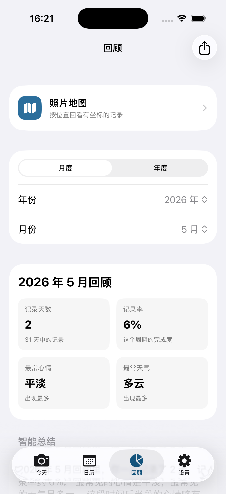

# WeatherMood365

WeatherMood365 is a personal iPhone diary app for recording one photo, the weather, a mood, a short note, and photo location for each day. Over time, it becomes a visual calendar of your year: what the sky looked like, where you were, and how the day felt.

WeatherMood365 是一个 iPhone 日常记录 App。它可以为每天保存一张照片、天气、心情、一句话和照片位置。一年下来，你会得到一个由照片、天气和心情组成的年度日历。

Current version: `2.0`

当前版本：`2.0`

## Screenshots / 截图

| Today / 今天 | Calendar / 日历 | Review / 回顾 |
| --- | --- | --- |
|  |  |  |

## What's New in 2.0 / 2.0 更新

WeatherMood365 2.0 expands the original daily photo diary into a fuller personal review app:

- Added yearly and monthly review dashboards with mood distribution, weather distribution, streaks, keywords, local insights, mood trends, selected photos, and poster export.
- Added Home Screen widgets for today's status, latest record, and yearly progress.
- Added daily reminders that automatically skip days already recorded.
- Added Markdown and JSON text export, plus JSON import for text archives.
- Added two new photo export styles: weather postcard and film border.
- Improved detail pages with richer weather metrics, location display, image preview, safer deletion, and export preview.
- Improved the calendar, map, and recent-record experience with more consistent image loading and layout.
- Added optional system photo album sync through a dedicated WeatherMood365 album.
- Improved save stability around photo-library syncing, Widget snapshots, background persistence, and image cache invalidation.
- Updated the app icon and refreshed several UI interaction styles.

相比 1.0，WeatherMood365 2.0 从“每日照片天气心情记录”扩展成了更完整的个人回顾工具：

- 新增年度/月度回顾，支持心情分布、天气分布、连续记录、关键词、本地总结、心情趋势、精选照片和回顾海报导出。
- 新增桌面小组件：今日打卡、最近记录、年度进度。
- 新增每日提醒，并会在当天已有记录时自动顺延。
- 新增 Markdown / JSON 文本导出，以及 JSON 文本归档导入。
- 新增天气明信片、胶片边框两种照片导出样式。
- 详情页增强天气细节、位置展示、图片预览、删除确认和导出预览。
- 优化日历、地图、最近记录的图片加载和布局。
- 新增可选同步到系统 WeatherMood365 相簿，让 iCloud 照片接管照片备份。
- 优化保存稳定性，特别是相册同步、Widget 快照、后台持久化和图片缓存失效。
- 更新 App 图标，并统一部分 UI 交互样式。

## Features / 功能

- Take a photo directly from the app, or choose one from the system photo library.
- Read photo date and GPS location from selected library photos when available.
- Fetch current weather automatically, with manual weather selection as a fallback.
- Record one of five moods: 开心、平淡、惬意、烦躁、低落.
- Add a short note for the day.
- Browse records through Today, yearly calendar, monthly detail, recent records, review pages, and a photo map.
- View, edit, delete, preview, and export records.
- Export photos as original images, Polaroid-style frames, Colorwalk dominant-color frames, weather postcards, or film borders.
- Export yearly and monthly review posters.
- Optional system WeatherMood365 photo album sync for new camera records.
- Daily reminders through local notifications.
- Text archive export as Markdown or JSON, and JSON import.
- Home Screen widgets powered by a local App Group snapshot.

- 直接拍照，或从系统相册选择照片。
- 选择相册照片时，尽量读取照片原始日期和 GPS 位置信息。
- 自动获取天气，也可以手动选择天气作为备用。
- 支持五种心情：开心、平淡、惬意、烦躁、低落。
- 为每天写一句话。
- 通过今天、年度日历、月份详情、最近记录、回顾页和照片地图查看记录。
- 支持查看、修改、删除、预览和导出记录。
- 支持原图、拍立得、Colorwalk、天气明信片、胶片边框等照片导出样式。
- 支持导出年度/月度回顾海报。
- 可选把 App 内拍摄的新记录照片同步到系统 WeatherMood365 相簿。
- 支持本地通知每日提醒。
- 支持 Markdown / JSON 文本归档导出，以及 JSON 导入。
- 支持通过 App Group 本地快照驱动桌面小组件。

## Tech Stack / 技术栈

- SwiftUI
- MapKit
- CoreLocation
- Photos / PhotosUI
- UIKit camera and photo library bridges
- Open-Meteo weather API
- Local JSON storage and local photo files
- WidgetKit

## Permissions / 权限说明

The app may request the following iOS permissions:

- Camera: used to take daily record photos.
- Photo Library: used to choose existing photos.
- Add to Photo Library: used to export images and optionally sync new camera records into a WeatherMood365 system album.
- Location When In Use: used to fetch current weather and attach current location to camera photos.
- Notifications: used for daily record reminders.

App 可能请求以下系统权限：

- 相机：用于拍摄每日记录照片。
- 相册读取：用于选择已有照片。
- 相册写入：用于导出图片，以及可选将 App 内拍摄的新记录同步到系统 WeatherMood365 相簿。
- 使用期间位置：用于获取当前天气，并为直接拍照的记录写入当前位置。
- 通知：用于每日记录提醒。

## Privacy / 隐私

WeatherMood365 stores diary records locally on the device. Photos are saved in the app sandbox, and record metadata is stored as local JSON. Optional photo-library sync copies camera records into a local WeatherMood365 system album so iCloud Photos can handle photo backup if the user has enabled it. Weather data is requested from Open-Meteo with latitude and longitude only when weather is fetched. The app does not include an account system, analytics, or a remote personal-data backend.

WeatherMood365 的记录数据保存在本机。照片存放在 App 沙盒中，记录元数据以本地 JSON 保存。可选相册同步会把 App 内拍摄的新记录复制到系统 WeatherMood365 相簿，之后可由用户自己的 iCloud 照片机制处理备份。获取天气时会向 Open-Meteo 请求当前经纬度对应的天气信息。当前版本不包含账号系统、统计分析或远程个人数据后台。

Home Screen widgets read a small local snapshot through the App Group `group.com.han.WeatherMood365`. The snapshot only contains the text summary needed by widgets and small local thumbnails. It is not uploaded anywhere.

桌面小组件通过 App Group `group.com.han.WeatherMood365` 读取本机摘要数据。共享内容只包含小组件展示需要的文字摘要和小尺寸缩略图，不会上传到云端。

## Import and Export / 导入导出

The Settings tab supports text export in Markdown and JSON. Markdown is designed for reading, sharing, or analysis with AI tools. JSON is designed as a text archive that can be imported back into the app. The current JSON archive includes date, weather, mood, and note. It does not include photos or photo locations.

“设置”Tab 支持 Markdown 和 JSON 文本导出。Markdown 适合阅读、分享或交给 AI 工具分析；JSON 适合做文字记录归档，并可重新导入 App。目前 JSON 归档包含日期、天气、心情和一句话，不包含照片或照片位置。

## Requirements / 运行要求

- macOS with Xcode installed
- iOS 18.0+
- Xcode project: `WeatherMood365.xcodeproj`
- Scheme: `WeatherMood365`

## Run Locally / 本地运行

Open the project in Xcode:

```bash
open WeatherMood365.xcodeproj
```

Or build from the command line:

```bash
xcodebuild -project WeatherMood365.xcodeproj -scheme WeatherMood365 -sdk iphonesimulator -configuration Debug build
```
