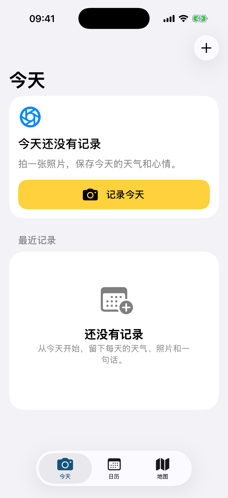
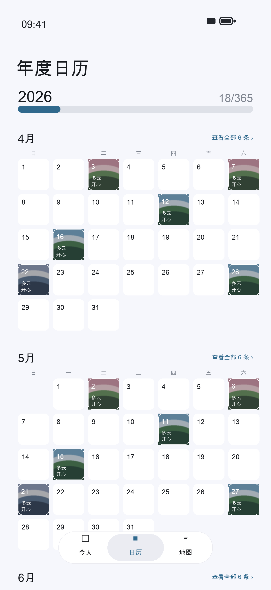
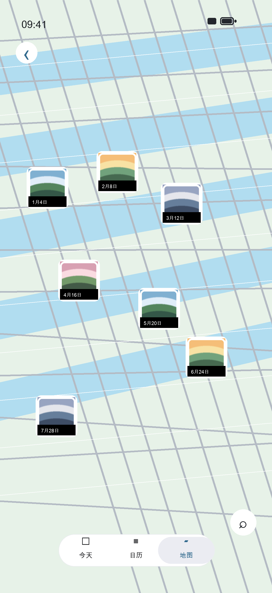

# WeatherMood365

WeatherMood365 is a personal iPhone diary app for recording one photo, the weather, a mood, a short note, and photo location for each day. Over time, it becomes a visual calendar of your year: what the sky looked like, where you were, and how the day felt.

WeatherMood365 是一个 iPhone 日常记录 App。它可以为每天保存一张照片、天气、心情、一句话和照片位置。一年下来，你会得到一个由照片、天气和心情组成的年度日历。

## Screenshots / 截图

| Today / 今天 | Calendar / 年度日历 | Map / 地图 |
| --- | --- | --- |
|  |  |  |

## Features / 功能

- Take a photo directly from the app, or choose one from the system photo library.
- Read photo date and GPS location from selected library photos when available.
- Fetch current weather automatically, with manual weather selection as a fallback.
- Record one of five moods: 开心、平淡、惬意、烦躁、低落.
- Add a short note for the day.
- Browse records through a yearly calendar, monthly lists, recent records, and a photo map.
- View, edit, delete, and export records.
- Export photos as original images, Polaroid-style frames, or Colorwalk dominant-color frames.

- 直接拍照，或从系统相册选择照片。
- 选择相册照片时，尽量读取照片原始日期和 GPS 位置信息。
- 自动获取天气，也可以手动选择天气作为备用。
- 支持五种心情：开心、平淡、惬意、烦躁、低落。
- 为每天写一句话。
- 通过年度日历、当月记录、最近记录和地图查看记录。
- 支持查看、修改、删除和导出记录。
- 支持原图、拍立得相框、Colorwalk 主色调相框三种导出方式。

## Tech Stack / 技术栈

- SwiftUI
- MapKit
- CoreLocation
- Photos / PhotosUI
- UIKit camera and photo library bridges
- Open-Meteo weather API
- Local JSON storage and local photo files

## Permissions / 权限说明

The app requests the following iOS permissions:

- Camera: used to take daily record photos.
- Photo Library: used to choose existing photos.
- Add to Photo Library: used to export framed photos back to the system album.
- Location When In Use: used to fetch current weather and attach the current location to camera photos.

App 会请求以下系统权限：

- 相机：用于拍摄每日记录照片。
- 相册读取：用于选择已有照片。
- 相册写入：用于把导出的照片保存回系统相册。
- 使用期间位置：用于获取当前天气，并为直接拍照的记录写入当前位置。

## Privacy / 隐私

WeatherMood365 stores diary records locally on the device. Photos are saved in the app sandbox, and record metadata is stored as local JSON. Weather data is requested from Open-Meteo with latitude and longitude only when weather is fetched. The app does not include an account system, analytics, or a remote personal-data backend.

WeatherMood365 的记录数据保存在本机。照片存放在 App 沙盒中，记录元数据以本地 JSON 保存。获取天气时会向 Open-Meteo 请求当前经纬度对应的天气信息。当前版本不包含账号系统、统计分析或远程个人数据后台。

## Requirements / 运行要求

- macOS with Xcode installed
- iOS 18.0+
- Xcode project: `WeatherMood365.xcodeproj`
- Scheme: `WeatherMood365`

## Run Locally / 本地运行

Open the project in Xcode:

```bash
open WeatherMood365.xcodeproj
```

Or build from the command line:

```bash
xcodebuild -project WeatherMood365.xcodeproj -scheme WeatherMood365 -destination 'platform=iOS Simulator,name=iPhone 17' build
```

## Version / 版本

Current version: `1.0`

当前版本：`1.0`

## Roadmap / 后续计划

- iCloud sync or backup/export for long-term records.
- More export templates.
- Calendar filtering by mood, weather, and location.
- Optional statistics for yearly mood and weather trends.

- iCloud 同步或长期备份/导出。
- 更多导出模板。
- 按心情、天气、位置筛选日历。
- 年度心情和天气趋势统计。

